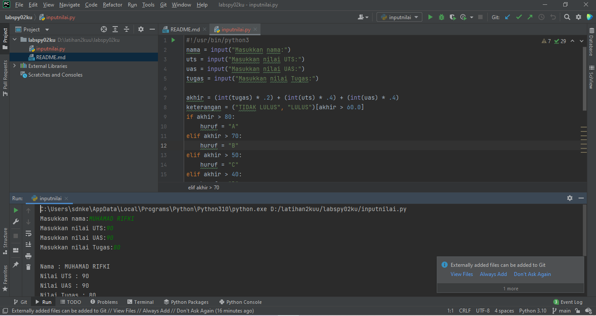
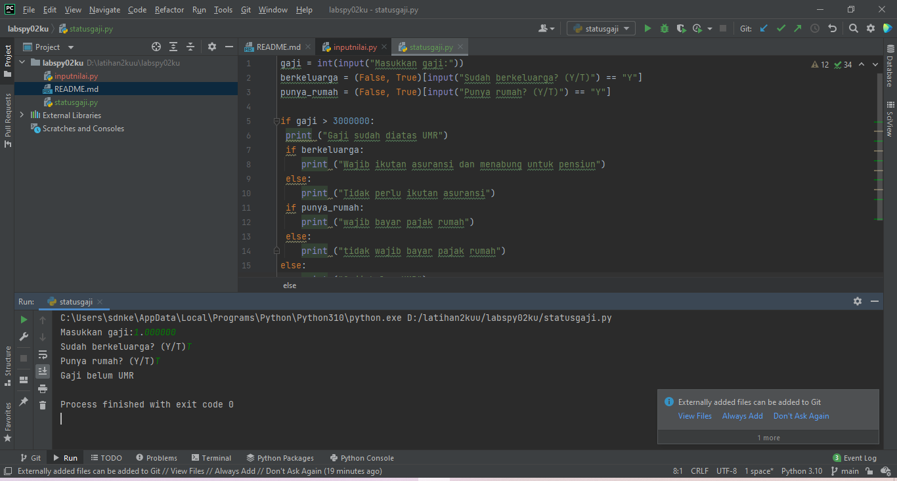
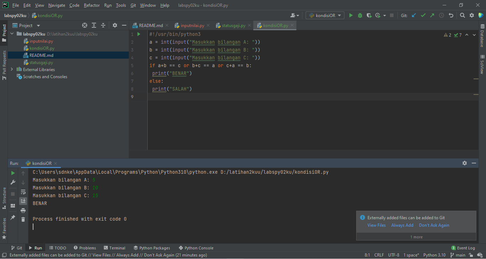
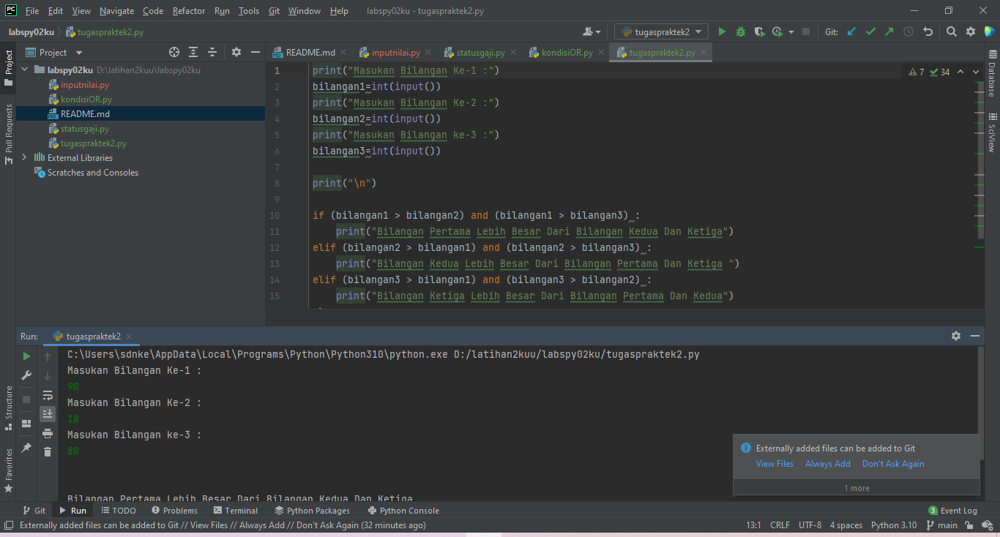
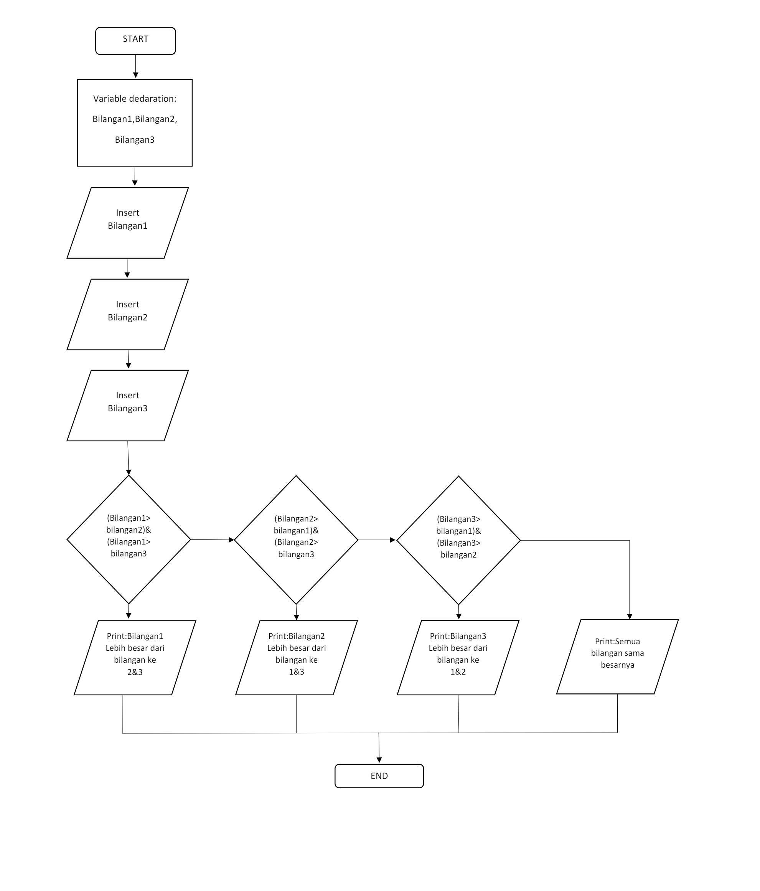

# labspy02ku
## Latihan praktek ke 2
### Berikut program - program yang telah di buat
    NAMA    :MUHAMAD RIFKI
    KELAS   :TI.21.A.1
    NIM     :312110205
    MATKUL  :BAHASA PEMROGRAMAN
Disini kita menggunakan pycharm untuk editornya.

1.Membuat program menentukan nilai akhir

Berikut untuk program nya:

Dan ini adalah output nya:

    C:\Users\sdnke\AppData\Local\Programs\Python\Python310\python.exe D:/latihan2kuu/labspy02ku/inputnilai.py
    Masukkan nama:MUHAMAD RIFKI
    Masukkan nilai UTS:90
    Masukkan nilai UAS:90
    Masukkan nilai Tugas:80

    Nama : MUHAMAD RIFKI
    Nilai UTS : 90
    Nilai UAS : 90
    Nilai Tugas : 80
    Nilai Akhir : 88.0

    Nilai Huruf : A
    Keterangan : LULUS

    Process finished with exit code 0
2.Membuat program menampilkan status gaji karyawan.

Berikut adalah program dari latihan di atas:

Dan ini adalah output dari program tersebut:

    
    C:\Users\sdnke\AppData\Local\Programs\Python\Python310\python.exe D:/latihan2kuu/labspy02ku/statusgaji.py
    Masukkan gaji:1,000000
    Sudah berkeluarga? (Y/T)T
    Punya rumah? (Y/T)T
    Gaji belum UMR

    Process finished with exit code 0
3.penggunaan kondisi OR
program membandingkan 3 input bilangan, apabila penjumlahan 2 bilangan hasilnya
sama dengan bilangan lainnya, maka cetak pernyataan “BENAR”

berikut untuk program nya:

dan ini hasil output nya yang menyatakan benar:
    
    C:\Users\sdnke\AppData\Local\Programs\Python\Python310\python.exe D:/latihan2kuu/labspy02ku/kondisiOR.py
    Masukkan bilangan A: 5
    Masukkan bilangan B: 10
    Masukkan bilangan C: 15
    BENAR

    Process finished with exit code 0
hasil dari ke 3 bilangan tersebut kelipatan nya sama yaitu 5 maka pernyataan nya benar

4.Buat program sederhana dengan input tiga buah bilangan, dari ketiga bilangan
tersebut tampilkan bilangan terbesarnya. Gunakan statement if.

Berikut adalah program yang telah di buat dengan menggunakan statement if:

Berikut source code yang saya buat dari screenshot di atas:

    print("Masukan Bilangan Ke-1 :")
    bilangan1=int(input())
    print("Masukan Bilangan Ke-2 :")
    bilangan2=int(input())
    print("Masukan Bilangan ke-3 :")
    bilangan3=int(input())

    print("\n")

    if (bilangan1 > bilangan2) and (bilangan1 > bilangan3) :
        print("Bilangan Pertama Lebih Besar Dari Bilangan Kedua Dan Ketiga")
    elif (bilangan2 > bilangan1) and (bilangan2 > bilangan3) :
        print("Bilangan Kedua Lebih Besar Dari Bilangan Pertama Dan Ketiga ")
    elif (bilangan3 > bilangan1) and (bilangan3 > bilangan2) :
        print("Bilangan Ketiga Lebih Besar Dari Bilangan Pertama Dan Kedua")
    else:
        print("Semua Bilangan Sama Besar Nya")
Kalian bisa pelajari statment if syntax di atas tetapi di sini saya akan menjelaskan beberapa proses pembuatannya:

Pada syntax diatas bahwa terdapat dua pengecekan pada angka pertama yaitu:

(bilangan1 > bilangan2) -> Apakkah angka pertama lebih besar dari angka kedua DAN

(Bilangan1 > bilangan3) -> Apakah angka pertama lebih besar dari angka ketiga.

Apabila jika pengecekan bersifat benar (Angka Pertama Lebih Besar Dari Angka Kedua Dan Tiga), maka sytem akan menampilkan output berupa :

    print(f"Bilangan pertama ({bilangan1}) lebih besar dari bilangan ketiga")

Dan akan memunculkan hasil seperti berikut :Bilangan pertama ({bilangan1}) lebih besar dari bilangan kedua dan ketiga

Jika dalam pengecekan ada yang salah atau nilai pertama tidak lebih besar dari nilai kedua dan ketiga, maka akan melakukan pengecekan selanjutya ke fungsi elif yaitu dengan source berik
   
     elif (bilangan2 > bilangan1) and (bilangan2 > bilangan3) :

Pada syntax diatas dijelaskan bahwa terdapat dua pengecekan pada angka kedua nya, yaitu :

1. (bilangan2 > bilangan1) = Apakah bilangan kedua lebih besar dari bilangan pertama dan

2. (bilangan2 > bilangan3) = Apakah bilangan kedua lebih besar dari bilangan ketiga. 
print(f"Bilangan kedua ({bilangan2)} lebih besar dari bilangan pertama dan ketiga")
Dan akan menampilkan hasil seperti : Bilangan kedua ({bilangan2)} lebih besar dari bilangan pertama dan ketiga

Seperti langkah di atas, jika dalam pengecekan salah atau bilangan kedua lebih kecil dari bilangan pertama dan ketiga system akan melanjutkan ke pengecekan selanjutnya :

Untuk pengecekan selanjutnya saya akan melakuka pengecekan berupa Semua Bilangan Sama Besar Nya

Untuk membuat pengecekan kondisi tersebut dengan menggunakan syntax/source code berikut:

    elif (bilangan1 == bilangan2) and (bilangan1 == bilangan3) and (bilangan2 == bilangan3) 
Pada syntax diatas dijelaskan terdapat tiga pengecekan pada semmua variable, yaitu :

    1.(bilangan1 == bilangan2) Apakah bilangan pertama lebih besar dari bilangan kedua dan

    2.(bilangan1 == bilangan3) Apakah bilangan pertama lebih besar dari bilangan ketiga dan

    3.(bilangan2 == bilangan3) Apakah bilangan kedua lebih besar dari bilangan ketiga.
    Setelah dilakukan pengecekan dan ternnyata semua angka sama besar, maka system akan menampilkan output dengan perintah berikut :

    print("Semua Bilangan Sama Besar Nya")
Dari syntax diatas akan menampilkan hasil berupa Semua Bilangan Sama Besarnya
Dan terakhir system sudah memperoses untuk melakukan pengecekan pada If, Elif maka system harus menentukan pilihan terakhir dengan menggunakan fungsi else menurut kondisi dimana system telah melakukan pengecekan pada fungsi if dan else tetapi tidak ada hasil yang di inginkan menempatkan kasus program ini, saya melakukan pengecekan kondisi :

Pengecekan pertama pada bilangan1 apakah lebih besar, jika tidak maka melakukan pengecekan ke bilangan2 jika masih belum menampilkan, mari kita coba.

Untuk menampilkan hasil akhir, maka hanya dengan menggunakan syntax sebagai berkut :

    else:
        print(f"Bilangan ketiga ({bilangan3}) lebih besar dari bilangan pertama dan kedua")
    
    Pada syntax diatas akan menampilkan hasil berupa :
    Bilangan ketiga ({bilangan3}) lebih besar dari bilangan pertama dan kedua
Saya akan menampilkan contoh berupa script output dari program di atas di jalankan dengan berbeda.

ini adalah hasil output jika bilangan dari pertama,kedua dan ketiga sama besarnya:

 
    C:\Users\sdnke\AppData\Local\Programs\Python\Python310\python.exe D:/latihan2kuu/labspy02ku/tugaspraktek2.py
    Masukan Bilangan Ke-1 :
    90
    Masukan Bilangan Ke-2 :
    90
    Masukan Bilangan ke-3 :
    90

    Semua Bilangan Sama Besar Nya

    Process finished with exit code 0
dan ini adalah output dari hasil  bilangan ketiga lebih besar dari bilangan pertama dan kedua
   
    C:\Users\sdnke\AppData\Local\Programs\Python\Python310\python.exe D:/latihan2kuu/labspy02ku/tugaspraktek2.py
    Masukan Bilangan Ke-1 :
    18
    Masukan Bilangan Ke-2 :
    19
    Masukan Bilangan ke-3 :
    30

    Bilangan Ketiga Lebih Besar Dari Bilangan Pertama Dan Kedua

    Process finished with exit code 0
berikut gambar dari flowchart program di atas:

Terimakasih itu saja yang bisa saya jelaskan untuk lebih detail tentang script nya kalian bisa,
langsung klik project di atas terimakasih.

    Wassalamualaikum wr wb keep happy and stay healthy.

